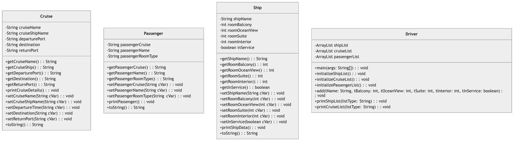

# Luxury Ocean Cruise Management System

This project is a **Java-based application** designed to streamline and automate the management of luxury ocean cruises. The system efficiently handles **ships, cruises, passengers**, and other related functionalities. Built using **object-oriented programming principles**, it provides a menu-based interface for managing core operations.

---

## Table of Contents

- [Overview](#overview)
- [Features](#features)
- [UML Diagram](#uml-diagram)
- [Classes and Methods](#classes-and-methods)

---

## Overview

The **Luxury Ocean Cruise Management System** aims to:
1. Automate cruise bookings and operations.
2. Provide an accurate and efficient way to coordinate cruise bookings for ship owners and operators.
3. Ensure no overbooking occurs by managing the number of cabins (balcony, ocean view, suite, interior) per ship.

### Primary Components:
- **Ships**: Represent the vessels available for cruises.
- **Cruises**: Represent the individual cruise trips.
- **Passengers**: Represent the customers booking a cruise.

---

## Features

- Manage ships with details like room types (balcony, ocean view, suite, interior) and availability.
- Create and manage cruises assigned to specific ships.
- Book passengers on cruises with no overbooking allowed.
- Menu-based interface for easy navigation and operation.

---

## UML Diagram

The following UML diagram illustrates the structure and relationships between the main classes in the system:

---

## Classes and Methods

### 1. **Ship**
- **Attributes**:
  - `shipName`: Name of the ship.
  - `roomBalcony`, `roomOceanView`, `roomSuite`, `roomInterior`: Number of rooms by type.
  - `inService`: Whether the ship is in service.
- **Methods**:
  - `getShipName()`, `getRoomBalcony()`, `getRoomOceanView()`, `getRoomSuite()`, `getRoomInterior()`, `getInService()`: Getters for attributes.
  - `setShipName(String cVar)`, `setRoomBalcony(int cVar)`, `setRoomOceanView(int cVar)`, `setRoomSuite(int cVar)`, `setRoomInterior(int cVar)`, `setInService(boolean cVar)`: Setters for attributes.
  - `printShipData()`: Displays ship details.
  - `toString()`: Returns a string representation of the ship.

---

### 2. **Cruise**
- **Attributes**:
  - `cruiseName`: Name of the cruise.
  - `cruiseShipName`: Ship assigned to the cruise.
  - `departurePort`, `destination`, `returnPort`: Cruise route information.
- **Methods**:
  - `getCruiseName()`, `getCruiseShip()`, `getDeparturePort()`, `getDestination()`, `getReturnPort()`: Getters for attributes.
  - `setCruiseName(String cVar)`, `setCruiseShipName(String cVar)`, `setDeparturePort(String cVar)`, `setDestination(String cVar)`, `setReturnPort(String cVar)`: Setters for attributes.
  - `printCruiseDetails()`: Displays cruise details.
  - `toString()`: Returns a string representation of the cruise.

---

### 3. **Passenger**
- **Attributes**:
  - `passengerCruise`: Cruise booked by the passenger.
  - `passengerName`: Name of the passenger.
  - `passengerRoomType`: Type of room booked.
- **Methods**:
  - `getPassengerCruise()`, `getPassengerName()`, `getPassengerRoomType()`: Getters for attributes.
  - `setPassengerCruise(String cVar)`, `setPassengerName(String cVar)`, `setPassengerRoomType(String cVar)`: Setters for attributes.
  - `printPassenger()`: Displays passenger details.
  - `toString()`: Returns a string representation of the passenger.

---

### 4. **Driver**
- **Attributes**:
  - `shipList`: ArrayList to store all ships.
  - `cruiseList`: ArrayList to store all cruises.
  - `passengerList`: ArrayList to store all passengers.
- **Methods**:
  - `main(String[] args)`: Entry point of the program.
  - `initializeShipList()`: Initializes the list of ships.
  - `initializeCruiseList()`: Initializes the list of cruises.
  - `initializePassengerList()`: Initializes the list of passengers.
  - `addShip(String tName, int tBalcony, int tOceanView, int tSuite, int tInterior, boolean tInService)`: Adds a new ship to the system.
  - `printShipList(String listType)`: Prints all ships or those in service.
  - `printCruiseList(String listType)`: Prints all cruises.

