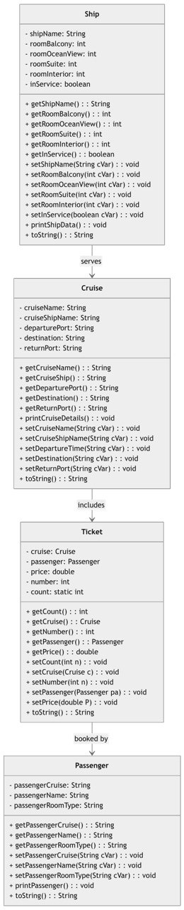

# Luxury Ocean Cruise Management System

This project is a **Java-based application** designed to reduce the manual workload involved in managing luxury ocean cruises. The system efficiently handles **customers, bookings, timetables**, and other related functionalities. The application is built on **object-oriented programming principles** and provides a menu-based system for managing core operations.

---

## Table of Contents

- [Overview](#overview)
- [Features](#features)
- [UML Diagram](#uml-diagram)
- [Classes and Methods](#classes-and-methods)


---

## Overview

The **Luxury Ocean Cruise Management System** aims to:
1. Automate cruise bookings and operations.
2. Provide an accurate and efficient ability to coordinate cruise bookings for ship owners and operators.
3. Ensure no overbooking occurs by managing the number of cabins (balcony, ocean view, suite, interior) per ship.

The system includes the following primary components:
- **Ships**: Represent the vessels available for cruises.
- **Cruises**: Represent the individual cruise trips.
- **Passengers**: Represent the customers booking a cruise.
- **Tickets**: Represent the booking details for a passenger on a cruise.

---

## Features

- Manage ships with details like room types (balcony, ocean view, suite, interior) and availability.
- Create and manage cruises assigned to specific ships.
- Book passengers on cruises with no overbooking allowed.
- Generate tickets for passengers with detailed booking information.
- Menu-based interface for easy navigation and operation.

---

## UML Diagram

The following UML diagram illustrates the structure and relationships between the main classes in the system:



---

## Classes and Methods

### 1. **Ship**
- **Attributes**:
  - `shipName`: Name of the ship.
  - `roomBalcony`, `roomOceanView`, `roomSuite`, `roomInterior`: Number of rooms by type.
  - `inService`: Whether the ship is in service.
- **Methods**:
  - Getters and setters for all attributes.
  - `printShipData()`: Displays ship details.

---

### 2. **Cruise**
- **Attributes**:
  - `cruiseName`: Name of the cruise.
  - `cruiseShipName`: Ship assigned to the cruise.
  - `departurePort`, `destination`, `returnPort`: Cruise route information.
- **Methods**:
  - Getters and setters for all attributes.
  - `printCruiseDetails()`: Displays cruise details.

---

### 3. **Passenger**
- **Attributes**:
  - `passengerCruise`: Cruise booked by the passenger.
  - `passengerName`: Name of the passenger.
  - `passengerRoomType`: Type of room booked.
- **Methods**:
  - Getters and setters for all attributes.
  - `printPassenger()`: Displays passenger details.

---

### 4. **Ticket**
- **Attributes**:
  - `cruise`: The cruise associated with the ticket.
  - `passenger`: The passenger associated with the ticket.
  - `price`: Ticket price.
  - `number`: Ticket number.
- **Methods**:
  - Getters and setters for all attributes.
  - `printPassenger()`: Displays ticket details.

---

## How to Run

1. **Clone the Repository**:
   ```bash
   git clone https://github.com/yourusername/luxury-ocean-cruise.git
   cd luxury-ocean-cruise
